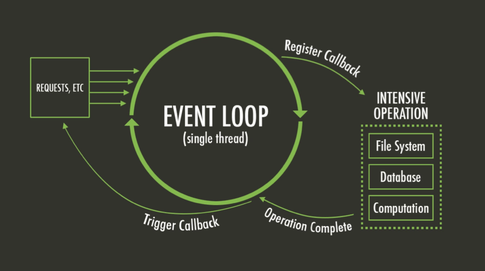

# Clase 1: Nivelación (TP, Javascript)

- DOM
- Funciones
- Clases y objetos

---

### Links utiles

- [Node.js](https://nodejs.org/en/)
- [NVM](https://github.com/coreybutler/nvm-windows/releases)
  `Administra las versiones de Node.js en el servidor `
- [Express](https://expressjs.com/)
- [Angular](https://angular.io/)
- [MongoDB](https://www.mongodb.com/es)
- [React.js](https://es.reactjs.org/)
- [MYSQL](https://www.mysql.com/)

---

## Actividades

- [x] Crear index.js
- [x] Iniciar npm (npm init)
- [x] Instalar nodemon
- [x] Crear servidor en puerto 3000

---

## Machetes

### NVM

- nvm ls => ver las versiones instaladas disponibles
- nvm use xx.x.x => elegir la version elegida a usar
- nvm uninstall xx.x.x => borrar la version elegida

### Como funciona node.js

single thread quiere decir q todos los comandos se hacen en una sola secuencia... **un solo** hilo, un proceso termina y empieza otro

---

## Material extra

- [What the heck is the event loop anyway? | Philip Roberts | JSConf EU](https://www.youtube.com/watch?v=8aGhZQkoFbQ)
- [The Node.js Event Loop: Not So Single Threaded](https://www.youtube.com/watch?v=zphcsoSJMvM)
- [Morning Keynote- Everything You Need to Know About Node.js Event Loop - Bert Belder, IBM](https://www.youtube.com/watch?v=PNa9OMajw9w)
