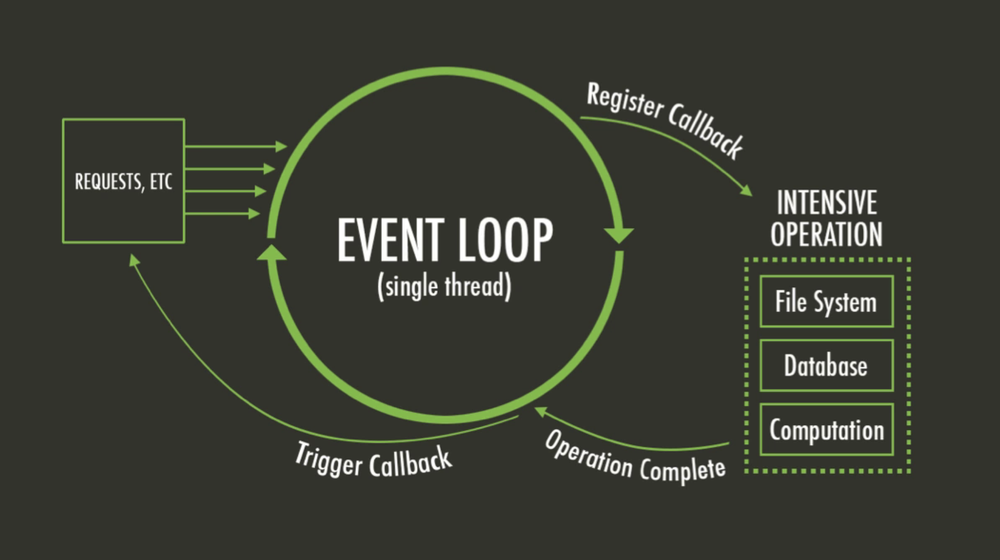
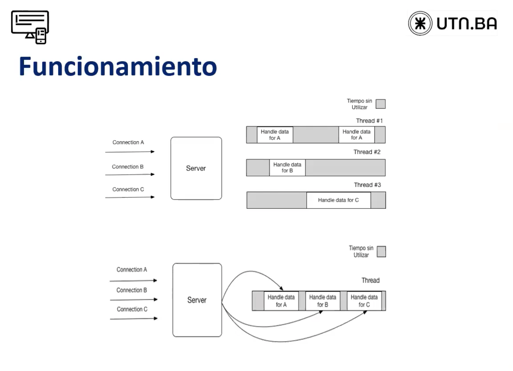

# Clase 2: NodeJS + express (Routing y vistas)

- Instalacion de express
- Routes, app.js y www
- Verbos http y headers

---

### Links utiles

- [MYSQL Workbench](https://dev.mysql.com/downloads/workbench/)
- [XAMPP](https://www.apachefriends.org/download.html)

---

## Actividades

- [x] Crear index.js
- [x] Iniciar npm (npm init)
- [x] Instalar nodemon
- [x] Crear servidor en puerto 3000

---

## Cheatsheet

### NVM

- nvm ls => ver las versiones instaladas disponibles
- nvm install xx.x.x => instalar la version elegida
- nvm uninstall xx.x.x => borrar la version elegida
- npm init => inicia node
- npm install => instala los modulos de node
- nvm use xx.x.x => elegir la version elegida a usar

---

## Machetes

### Como funciona node.js

Node está completamente **controlado por eventos**: Vamos a tener un subproceso que procesa un evento tras otro.

single thread quiere decir q todos los comandos se hacen en una sola secuencia... **un solo** hilo, un proceso termina y empieza otro


### Módulos

- Un módulo es un **conjunto de funciones y objetos** de JavaScript que las aplicaciones externas pueden usar.
- Node.js posee varios módulos incorporados (nativos) compilados en binario. Estos módulos básicos están definidos en el código fuente de Node en la carpeta lib/.
- Los módulos básicos tienen la preferencia de **cargarse primero** si su identificador es pasado desde **require().**
- Por ejemplo, require('http') siempre devolverá lo construido en el módulo HTTP, incluso si hay un fichero con ese nombre.

### Módulo HTTP

- HTTP es un módulo **nativo** de Node.js
- Trabaja con el **protocolo HTTP**, que es el que se utiliza en Internet para transferir datos en la Web.
- Nos va a servir para crear un **servidor HTTP que acepte solicitudes** desde un cliente web.
- Para poder utilizarlo en nuestro código, tenemos que requerirlo mediante la instrucción "require()".
- Por ejemplo, require('http') siempre devolverá lo construido en el módulo HTTP.

### Servidor HTTP

```
var http = require(' http ');
```

- A partir de este momento tenemos una **variable http** (que en realidad es un objeto) sobre la que **podemos invocar métodos** que estaban en el módulo requerido.
- Por ejemplo, una de las tareas implementadas en el módulo HTTP es la de crear un servidor, que se hace con el módulo "createServer()".
- Este método recibirá un callback que se ejecutará cada vez que el servidor reciba una petición.

```
var server = http.createServer( function ( request, response ) {

    response.end( "Hello world" );

});
```

- La función **callback** que enviamos a createServer() **recibe** dos parámetros que son la **petición y la respuesta**.
- La petición por ahora no la usamos, pero contiene datos de la petición realizada.
- La **respuesta** la usaremos para **enviarle datos al cliente** que hizo la petición.
- De modo que **"respuesta.end()"** sirve para **terminar la petición y enviar los datos al cliente**.

```
server.listen( 3000, function () {

    console.log( "tu servidor está listo en " + this.address().port );

});
```

- Con esto **le decimos al servidor que escuche en el puerto 3000**, aunque podríamos haber puesto cualquier otro puerto que nos hubiera gustado.
- **"listen()" recibe** también **una función callback** que realmente no sería necesaria, pero que nos sirve para hacer cosas cuando el servidor se haya iniciado y esté listo.
- Simplemente, en esa función callback **indico que estoy listo y escuchando en el puerto** configurado.
- En muy pocas líneas de código **generamos un servidor web que está escuchando en un puerto dado**. Ahora podemos guardar ese archivo con extensión .js, por ejemplo “servidor.js”.

### Manejo de archivos

- En todo sistema, es posible que nos topemos con la necesidad de que algunos datos **persistan más allá de la ejecución del programa.**
- Una de las opciones con las que contamos es el uso de archivos.
- Según el caso, existen ventajas y desventajas en utilizar el sistema de archivos como medio de almacenamiento de información:
  - Son fáciles de usar.
  - No requieren el uso de programas externos para su creación, lectura o edición.
  - En ocasiones, pueden ser abiertos y editados desde programas de edición de texto simples como un bloc de notas (¡siempre que se trate de texto!).
  - Son fáciles de compartir o enviar a otros usuarios/programas.
  - Consultas sobre algún dato puntual entre todos los datos almacenados (y no podamos guardar todo el lote de datos en memoria).
  - Ediciones de datos puntuales (que no requieren sobreescribir el archivo por completo).
  - Lecturas que combinen datos obtenidos de varios archivos (nuevamente, suponiendo que no podemos guardar todos los datos en memoria).
  - Probablemente sea mejor considerar el uso de un motor de base de datos.

### Módulo nativo file system: fs

- fs es la abreviatura en inglés para file system o sistema de archivos y es, además, uno de los módulos más básicos y útiles de Node.js.
- En Node.js es posible manipular archivos a través de fs (crear, leer, modificar, etc.).
- La mayoría de las funciones que contiene este módulo pueden usarse tanto de manera sincrónica como asincrónica

##### Aclaración: Hay que tener en cuenta que esto sólo aplica a Node.js, desde el navegador no es posible manipular archivos dado que sería muy inseguro.

---

## Material extra

- ['return await promise' vs 'return promise' in JavaScript](https://dmitripavlutin.com/return-await-promise-javascript/)
- [The Node.js Event Loop: Not So Single Threaded](https://www.youtube.com/watch?v=zphcsoSJMvM)
- [Morning Keynote- Everything You Need to Know About Node.js Event Loop - Bert Belder, IBM](https://www.youtube.com/watch?v=PNa9OMajw9w)

---

## Lección

[clase 2](https://centrodeelearning.zoom.us/rec/play/SR1hxWAkUYADRi3SlNPHRvHKBOz0rAHWI5zu8F24F5HxqkeReJHf8ja0qOmiPfV3G5vmps0J_mW0iVRt.nDS9qm0hxPbWV1hJ?startTime=1629742184000&_x_zm_rtaid=sKBeELBBQ_CM9cCVOv6PlA.1629858037583.422514940b9a0bf7b53636adabbf55f8&_x_zm_rhtaid=93)
